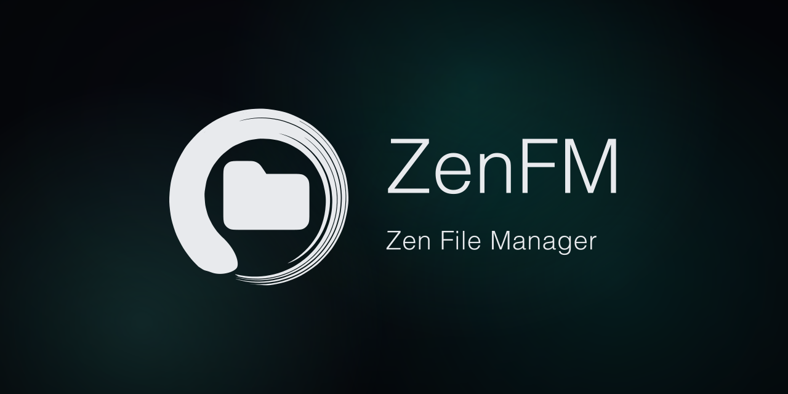

# ZenFM



[Website](https://zen-labs.org/zen-fm) · [Releases](https://github.com/xZenLabs/zen-fm/releases) · [Installation guide](#first-start) · [Discord](https://discord.zen-labs.org)

ZenFM is a web based file manager built for E-Reader devices that run KOReader. ZenFM directly connects your computer/phone to your E-Reader allowing you to manage your files.


The project is a clean-break successor to File Browser. It keeps the useful
file-management model while replacing Vue and self-contained JWTs with a
TypeScript/React/MUI frontend and revocable server-side sessions implemented in Go.

## Features

- Browse, search, upload, download, create, edit, move, copy, rename, and delete
  files from a responsive list or grid.
- Resumable uploads, checksums, previews, archives, public shares, themes, and
  localization.
- One owner account, opaque browser sessions, CSRF protection, and separate
  expiring personal API tokens.
- HTTPS by default with a per-device certificate.
- Plain HTTP requests on the HTTPS port redirect to the same URL over HTTPS.
- Optional, customizable server auto-stop and an explicit HTTP fallback.
- Advanced `/` mode for owners who intentionally need the entire device
  filesystem.

## First start

1. Install the ZenFM by [downloading](https://github.com/xZenLabs/zen-fm/releases). Choose the correct version for your device.

2. Place the **unzipped** folder `zenfm.koplugin` folder in the `/koreader/plugins` folder. Then restart KOReader.

3. Open **File browser > ZenFM** and start the server.

4. Open the URL displayed by the plugin from another device.

5. Sign in with the password `koreader123456789` and immediately choose a new password.

> On the first Android start, approve the native **Start ZenFM?** prompt only
when you just selected **Start ZenFM** in KOReader. That first approval links
the companion to KOReader.

> On BOOX devices, **ZenFM Backend** appears under Apps. Turn off **App Freeze**
for it under **Apps > App Management**, because a frozen companion cannot
receive KOReader's start request.

When first connecting you will see a warning from your browser. This is because ZenFM uses a locally generated, self signed certificate which enables encrypted communication within your local network. You also have the option the enable unencrypted http requests on your local network in settings. 

You need to continue/dismiss the https certificate warning in your your browser or use the http unencrypted setting. You should only have to do this once.


## Translations

ZenFM's KOReader plugin and web interface are translated into:

| Locale | Language |
| --- | --- |
| `en` | English |
| `bg` | Bulgarian |
| `cs` | Czech |
| `de` | German |
| `el` | Greek |
| `es` | Spanish |
| `fr` | French |
| `it` | Italian |
| `ja` | Japanese |
| `nl` | Dutch |
| `pt_BR` | Brazilian Portuguese |
| `pt_PT` | European Portuguese |
| `ro` | Romanian |
| `ru` | Russian |
| `uk` | Ukrainian |
| `vi` | Vietnamese |
| `zh_CN` | Simplified Chinese |
| `zh_HK` | Traditional Chinese (Hong Kong) |
| `zh_MO` | Traditional Chinese (Macau) |
| `zh_TW` | Traditional Chinese |

Translation corrections are welcome in
[`plugin/zenfm.koplugin/locales/`](plugin/zenfm.koplugin/locales/).

## Development

For UI work without Go or a device:

```sh
cd frontend
npm ci
npm run dev:mock
```

Open <http://localhost:5173> and use the password `koreader`. The mock API and
its sample filesystem live
only in memory and reset when Vite restarts.

See [docs/development.md](docs/development.md) for local full-stack work,
device builds, KOReader installation paths, Android deployment, and device
logs.

Backend checks:

```sh
go test ./...
go test -race ./...
```

Frontend checks (using Node 24 and Go 1.26.6 to match CI):

```sh
cd frontend
npm ci
npm run test:e2e:install
npm test
```

`npm test` runs the same frontend gate as CI: typechecking, linting, Vitest,
the production build, and the real-binary Playwright suite. Use
`npm run test:unit` for a faster unit-only check while iterating.

Build an unsigned e-reader development bundle with:

```sh
sh build.sh --dev
```

This builds only the e-reader backends and does not require the Android or
macOS build toolchains. To build and install the Android companion and its
KOReader plugin on an authorized ADB device, run:

```sh
sh build.sh --dev --android
```

Run `sh build.sh` for all local packages.
CI supplies the persistent Android signing credentials when producing release
packages.

The API contract is under `docs/api/`; architecture and security decisions are
documented under `docs/` and in [SECURITY.md](SECURITY.md).


### Runtime defaults

| Policy | Default |
| --- | --- |
| Browser idle / absolute lifetime | 2 hours / 12 hours |
| Personal API token | 30 days; configurable up to 1 year |
| Password-protected share session | 30 minutes, capped by share expiry |
| Ordinary browser request | 30 seconds; the owner may set `0` to disable the client timer |
| Search request | 2 minutes |
| Upload and download | No total limit; 30 seconds without progress |
| Server auto-stop | 30 minutes on Android; off elsewhere; configurable up to 12 hours |
| HTTPS and explicit HTTP port | 54321 by default, shared by both modes |

The `serve` command exposes `--session-idle` and `--session-absolute` for
controlled deployments and qualification tests; KOReader uses the defaults.

### Release artifacts

| Environment | Artifact |
| --- | --- |
| 32-bit Kindle/Kobo/other e-reader | `ZenFM-koreader-ereader-<version>.zip` |
| Linux KOReader (amd64/arm64) | `ZenFM-koreader-linux-<version>.zip` |
| macOS KOReader | `ZenFM-koreader-macos-<version>.zip` |
| Android KOReader plugin | `ZenFM-koreader-android-<version>.zip` |
| Android backend companion | `ZenFM-android-<version>.apk` |

Android requires both the plugin ZIP and companion APK. Other bundles contain
their matching backend directly.
KOReader plugin updates activate atomically and roll back automatically after a
failed health check. Companion APK updates are signature/hash checked,
journaled across Android's Package Installer, and health-gated after
replacement. Android does not grant an ordinary sideloaded app silent downgrade
authority, so a broken APK that cannot launch requires an owner-approved newer
signed APK or manual reinstall of the previous trusted APK.


## License

AGPL-3.0. See [THIRD_PARTY_NOTICES.md](THIRD_PARTY_NOTICES.md) for reused
project attribution.
